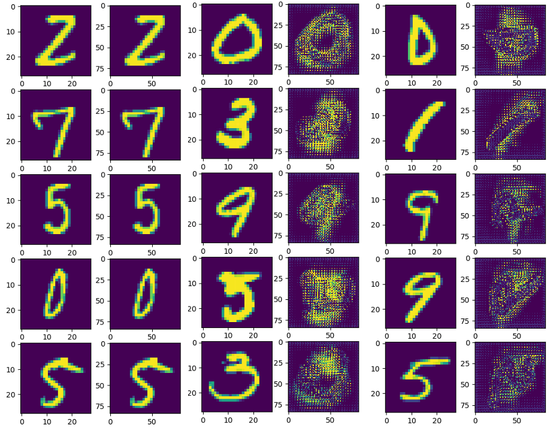

# DIP course
## TODO list
- [ ] 分析STN的梯度流
- [ ] 初始化仿射变换的参数，使得source与目标无交集，观察记录梯度与变换的迭代过程
- [ ] 验证deformable conv的正确性
- [ ] 改进deformable conv中生成grid的实现（在下觉得应该能改进）
- [ ] 按runtime warning要求修改
- [ ] 可视化多层offset
- [ ] 把注释写好(^_^)
- [ ] 把代码变美(T_T)

## Our Work
    尚待探索QAQ

## Expriments show
1. simple mnist demo
simple deformed feature show

'''
loss:0.3693: 100%|██████████████████████████| 1875/1875 [13:49<00:00,  2.27it/s]
Test set: Average loss: 0.6595, Accuracy: 8028/10000 (80%)
loss:0.3668: 100%|██████████████████████████| 1875/1875 [13:37<00:00,  2.30it/s]
Test set: Average loss: 0.2132, Accuracy: 9465/10000 (94%)
loss:0.0920: 100%|██████████████████████████| 1875/1875 [13:41<00:00,  2.22it/s]
Test set: Average loss: 0.1768, Accuracy: 9518/10000 (95%)
loss:0.1807: 100%|██████████████████████████| 1875/1875 [13:49<00:00,  2.22it/s]
Test set: Average loss: 0.1769, Accuracy: 9491/10000 (94%)
loss:0.2635: 100%|██████████████████████████| 1875/1875 [13:32<00:00,  2.43it/s]
Test set: Average loss: 0.1519, Accuracy: 9548/10000 (95%)
loss:0.0343: 100%|██████████████████████████| 1875/1875 [13:19<00:00,  2.28it/s]
Test set: Average loss: 0.0966, Accuracy: 9710/10000 (97%)
loss:0.0518: 100%|██████████████████████████| 1875/1875 [13:15<00:00,  2.40it/s]
Test set: Average loss: 0.0873, Accuracy: 9737/10000 (97%)
'''

## Requirements
* [PyTorch-v0.4.0](http://pytorch.org/docs/0.4.0/)